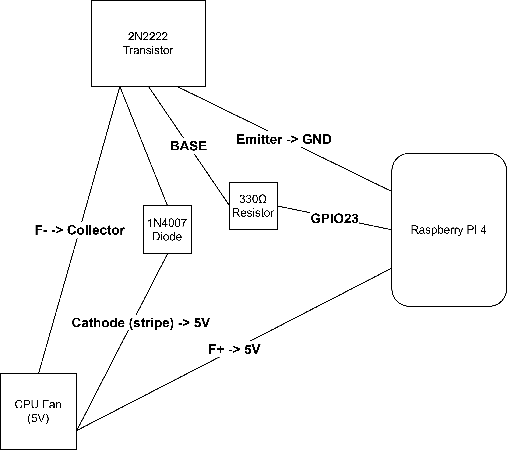

# Raspberry Pi 4 GPIO Fan Control on LineageOS 23

I made this tutorial to show how I set up a 5V fan controlled by GPIO 23 on my Raspberry Pi 4 running LineageOS 23. 

In my setup, the fan turns ON when GPIO 23 is HIGH and OFF when LOW, with an optional automatic fan script running at boot.

---

## 1. Hardware Design

### Components

- Raspberry Pi 4 (GPIO output)
- 5V fan (cooler)
- NPN transistor 2N2222
- Optional diode 1N4007 (for protection)
- 330 Ω resistor (for transistor base)

### Goal

Control the fan using GPIO 23: ON when HIGH, OFF when LOW.

### Hardware Diagram

The following diagram illustrates the wiring setup between the Raspberry Pi 4, the transistor, and the fan:




### Step-by-step Wiring

#### Step 1: Identify transistor pins (2N2222)

| Pin | Description |
|-----|-------------|
| Emitter (E) | Small pin at one end |
| Base (B) | Middle pin |
| Collector (C) | Pin at other end |

> Double-check your transistor datasheet; packages may vary.

#### Step 2: Connect the fan

- Red wire (+5V) → +5V power supply
- Black wire (−) → Collector (C) of 2N2222

#### Step 3: Connect transistor emitter

- Emitter (E) → GND (common ground with Raspberry Pi)

#### Step 4: Connect GPIO to transistor base

- GPIO 23 → 330–470 Ω resistor → Base (B)
- Resistor protects GPIO by limiting current.

#### Step 5: Optional diode across fan

- Cathode (stripe) → fan +5V
- Anode → fan − / transistor collector
- Prevents voltage spikes from damaging the transistor.

#### Step 6: Power the fan

- Fan red → +5V  
- Fan black → Collector (C)  
- Emitter → GND

#### Step 7: GPIO Logic

- GPIO 23 HIGH (3.3V) → transistor conducts → fan ON  
- GPIO 23 LOW (0V) → transistor off → fan OFF

### Summary Table

| Component        | Connect to                 | Notes                             |
|-----------------|----------------------------|----------------------------------|
| Fan + (red)      | +5V                        | Power supply                     |
| Fan − (black)    | Collector (C) of 2N2222    | NPN transistor switching side     |
| Emitter (E)      | GND                        | Common ground                     |
| GPIO 23           | Base (B) via 330–470 Ω resistor | Controls transistor               |
| 1N4007 diode     | Across fan, stripe to +5V  | Optional protection               |

---

## 2. ADB Software Configuration

This section sets up the fan control script to run automatically on boot.

### Step 1: Prepare the script

Create `fan_control.sh`:

```bash
#!/system/bin/sh

ON_THRESHOLD=75
OFF_THRESHOLD=60

while true; do
    TEMP=$(( $(cat /sys/class/thermal/thermal_zone0/temp) / 1000 ))

    if [ "$TEMP" -ge "$ON_THRESHOLD" ]; then
        gpioset gpiochip0 23=1
    elif [ "$TEMP" -le "$OFF_THRESHOLD" ]; then
        gpioset gpiochip0 23=0
    fi

    sleep 5
done
```

Make it executable:

```bash
chmod +x fan_control.sh
```

### Step 2: Create init service file

Create `fan_control.rc`:

```bash
service fan_control /data/local/fan_control.sh
    class main
    user root
    group root
    disabled
    seclabel u:r:init:s0

on property:sys.boot_completed=1
    start fan_control
```

### Step 3: Deploy files via ADB

1. Connect to your Pi:

```bash
adb connect <YOUR_PI_IP>
adb root
adb remount
```

2. Push files:

```bash
adb push fan_control.sh /data/local/
adb push fan_control.rc /data/local/
```

3. Set permissions and move RC file:

```bash
adb shell
chmod 755 /data/local/fan_control.sh
mv /data/local/fan_control.rc /vendor/etc/init/
chcon u:object_r:vendor_file:s0 /data/local/fan_control.sh
chcon u:object_r:vendor_configs_file:s0 /vendor/etc/init/fan_control.rc
exit
```

### Step 4: Reboot and verify

```bash
adb reboot
adb shell
getprop init.svc.fan_control
```

- Expected output: `running`  
- Your fan will now automatically turn on/off based on CPU temperature at boot.

---

### Notes

- The script polls CPU temperature every 5 seconds.  
- GPIO pin 23 must match your wiring.  
- Optional diode protects the transistor from voltage spikes.  
- Ensure root access is available, or the script will not control GPIO.  

---

## References

- [LineageOS 23 for Raspberry Pi 4 Android TV](https://konstakang.com/devices/rpi4/LineageOS23-ATV/)
- [Raspberry Pi GPIO Control Guide](https://www.raspberrypi.org/documentation/usage/gpio/)
